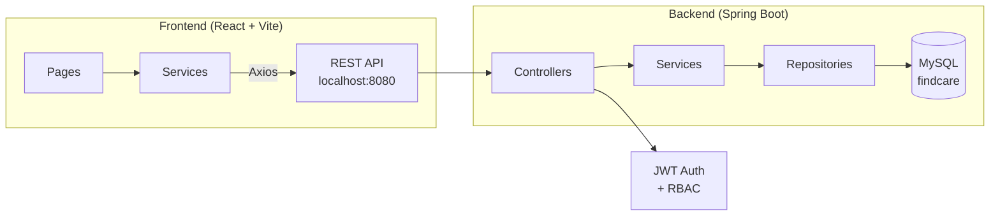

# FindCare — Detailed Project Description

**FindCare** is a full-stack hospital appointment management web application built for a college project. It enables patients to discover hospitals, browse doctors, and book appointments online, while providing role-specific dashboards for doctors, receptionists, and administrators.

---

## Tech Stack

| Layer | Technology | Version |
|-------|-----------|---------|
| **Frontend** | React (JSX) + Vite | React 19.1, Vite 6.3 |
| **Styling** | TailwindCSS | 3.4 |
| **Routing** | React Router DOM | 7.6 |
| **HTTP Client** | Axios | 1.7 |
| **Icons** | Lucide React | 0.577 |
| **Backend** | Spring Boot (Maven) | 4.0.3 |
| **Language** | Java | 21 |
| **Database** | MySQL (via JPA/Hibernate) | 8+ |
| **Auth** | JWT (jjwt 0.11.5) + Spring Security | — |
| **Code Gen** | Lombok | — |

---

## Architecture Overview



---

## User Roles & Access

| Role | Capabilities |
|------|-------------|
| **PATIENT** | Browse hospitals & doctors, view time slots, book/cancel appointments, view own appointments |
| **DOCTOR** | View personal schedule, view upcoming appointments, complete appointments with notes |
| **RECEPTIONIST** | View today's appointments, search patients by name/phone, check-in patients |
| **ADMIN** | Full CRUD on hospitals/departments/doctors, dashboard statistics, view all appointments |

---

## Backend Structure (~49 Java Files)

### Entities (7)
`User`, `Hospital`, `Department`, `Doctor`, `TimeSlot`, `Appointment` + Enums: `Role`, `HospitalType`, `AppointmentStatus`

### DTOs (13)
Request/Response objects: `SignupRequest`, `LoginRequest`, `AuthResponse`, `HospitalRequest/Response`, `DoctorRequest/Response`, `DepartmentRequest`, `AppointmentRequest/Response`, `TimeSlotRequest`, `DashboardStats`, `ApiResponse`

### Repositories (6)
`UserRepository`, `HospitalRepository`, `DepartmentRepository`, `DoctorRepository`, `TimeSlotRepository`, `AppointmentRepository` — all with custom query methods

### Services (6)
`AuthService`, `HospitalService`, `DoctorService`, `AppointmentService`, `TimeSlotService`, `DashboardService`

### Controllers (7 REST APIs)

| Controller | Base Path | Key Operations |
|-----------|-----------|----------------|
| AuthController | `/api/auth/*` | Signup, Login |
| HospitalController | `/api/hospitals/*` | CRUD + Search |
| DepartmentController | `/api/departments/*` | Create, List by hospital |
| DoctorController | `/api/doctors/*` | CRUD + List by hospital |
| TimeSlotController | `/api/timeslots/*` | Available slots by doctor/date |
| AppointmentController | `/api/appointments/*` | Book, Cancel, Check-in, List |
| DashboardController | `/api/dashboard/*` | Admin statistics |

### Security (4 files)
`SecurityConfig`, `JwtTokenProvider`, `JwtAuthenticationFilter`, `CustomUserDetailsService` — JWT-based auth with BCrypt password hashing and CORS for the React frontend.

### Exception Handling (3 files)
`GlobalExceptionHandler`, `ResourceNotFoundException`, `BadRequestException`

---

## Frontend Structure

### Pages (11)

| Page | Route | Access |
|------|-------|--------|
| [HomePage](file:///d:/Projects/College/findcare/frontend/src/pages/HomePage.jsx) | `/` | Public |
| [LoginPage](file:///d:/Projects/College/findcare/frontend/src/pages/LoginPage.jsx) | `/login` | Public |
| [RegisterPage](file:///d:/Projects/College/findcare/frontend/src/pages/RegisterPage.jsx) | `/register` | Public |
| [HospitalsPage](file:///d:/Projects/College/findcare/frontend/src/pages/HospitalsPage.jsx) | `/hospitals` | Public |
| [HospitalDetailPage](file:///d:/Projects/College/findcare/frontend/src/pages/HospitalDetailPage.jsx) | `/hospitals/:id` | Public |
| [DoctorsPage](file:///d:/Projects/College/findcare/frontend/src/pages/DoctorsPage.jsx) | `/doctors` | Public |
| [DoctorDetailPage](file:///d:/Projects/College/findcare/frontend/src/pages/DoctorDetailPage.jsx) | `/doctors/:id` | Public |
| [AppointmentsPage](file:///d:/Projects/College/findcare/frontend/src/pages/AppointmentsPage.jsx) | `/appointments` | Patient |
| [DoctorAppointmentsPage](file:///d:/Projects/College/findcare/frontend/src/pages/DoctorAppointmentsPage.jsx) | `/doctor/appointments` | Doctor |
| [ReceptionistPage](file:///d:/Projects/College/findcare/frontend/src/pages/ReceptionistPage.jsx) | `/receptionist` | Receptionist |
| [AdminDashboardPage](file:///d:/Projects/College/findcare/frontend/src/pages/AdminDashboardPage.jsx) | `/admin` | Admin |

### Layout Components (2)
- [Navbar](file:///d:/Projects/College/findcare/frontend/src/components/layout/Navbar.jsx) — Global navigation bar
- [ProtectedRoute](file:///d:/Projects/College/findcare/frontend/src/components/layout/ProtectedRoute.jsx) — Role-based route guard

### Context
- [AuthContext](file:///d:/Projects/College/findcare/frontend/src/context/AuthContext.jsx) — Manages login state, user info, and JWT token

### API Services (7)
`authService`, `hospitalService`, `departmentService`, `doctorService`, `timeSlotService`, `appointmentService`, `dashboardService` — all in [services/](file:///d:/Projects/College/findcare/frontend/src/services)

### Utilities
- [api.js](file:///d:/Projects/College/findcare/frontend/src/lib/api.js) — Axios instance configured with base URL and token interceptor
- [utils.js](file:///d:/Projects/College/findcare/frontend/src/lib/utils.js) — Helper utilities (likely `cn()` for TailwindCSS class merging via `clsx` + `tailwind-merge`)

---

## API Endpoints (20)

| Method | Endpoint | Description | Access |
|--------|----------|-------------|--------|
| POST | `/api/auth/signup` | Register user | Public |
| POST | `/api/auth/login` | Login user | Public |
| GET | `/api/hospitals` | List all hospitals | Public |
| GET | `/api/hospitals/{id}` | Get hospital by ID | Public |
| GET | `/api/hospitals/search?keyword=` | Search hospitals | Public |
| POST | `/api/hospitals` | Create hospital | Admin |
| PUT | `/api/hospitals/{id}` | Update hospital | Admin |
| DELETE | `/api/hospitals/{id}` | Delete hospital | Admin |
| GET | `/api/departments/hospital/{id}` | Get hospital departments | Public |
| POST | `/api/departments` | Create department | Admin |
| GET | `/api/doctors` | List all doctors | Public |
| GET | `/api/doctors/hospital/{id}` | Get hospital's doctors | Public |
| POST | `/api/doctors` | Create doctor | Admin |
| GET | `/api/timeslots/doctor/{id}/available?date=` | Available slots | Public |
| POST | `/api/appointments` | Book appointment | Patient |
| GET | `/api/appointments/patient/{id}` | Patient's appointments | Patient |
| PUT | `/api/appointments/{id}/cancel` | Cancel appointment | Patient |
| GET | `/api/appointments/today` | Today's appointments | Receptionist |
| PUT | `/api/appointments/{id}/checkin` | Check-in patient | Receptionist |
| GET | `/api/dashboard/admin/stats` | Dashboard statistics | Admin |

---

## Database

- **Name:** `findcare` (MySQL)
- **Schema:** Auto-generated by Hibernate (`ddl-auto=update`)
- **Port:** `3306` (default MySQL)
- **Backend Port:** `8080`

---

## How to Run

### Backend
```bash
# 1. Create database
mysql -u root -p -e "CREATE DATABASE findcare;"

# 2. Update credentials in backend/src/main/resources/application.properties

# 3. Start
cd backend
mvn spring-boot:run
# → http://localhost:8080
```

### Frontend
```bash
cd frontend
npm install
npm run dev
# → http://localhost:5173
```

---

## Project Status

| Component | Status |
|-----------|--------|
| Backend entities, repos, services, controllers | ✅ Complete |
| JWT authentication & RBAC | ✅ Complete |
| Database schema (auto-generated) | ✅ Complete |
| Exception handling | ✅ Complete |
| Frontend pages & routing | ✅ Complete |
| Frontend-backend API integration | ✅ Complete |
| TailwindCSS styling | ✅ Complete |
